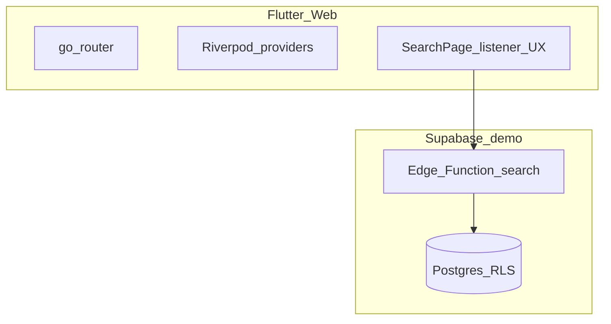

# Architecture (showcase)

- **Listener flow**: `EpisodeRepository.fetchFromSupabase` calls `GET /functions/v1/search?slug=&q=` with the anon key; on failure it falls back to bundled `assets/data/episodes.json` and client-side `SearchService` ranking.
- **Not included here**: RSS ingestion, media ASR/TTS workers, and proprietary creator pipelines remain private.
